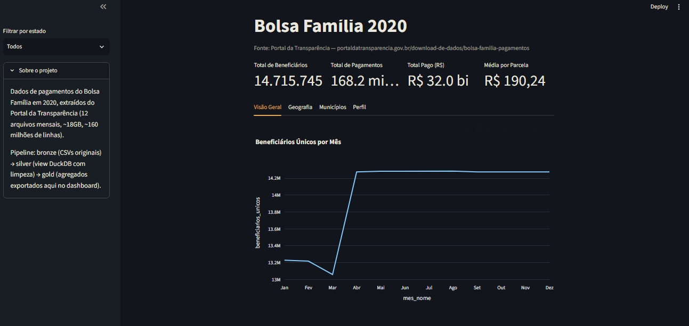
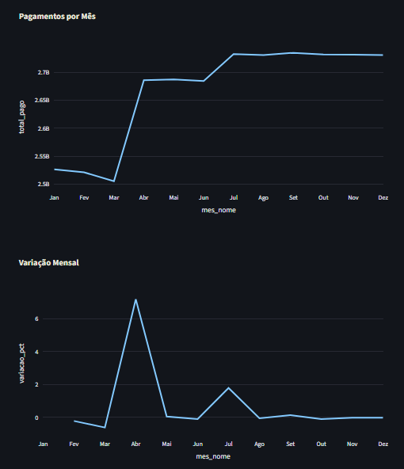
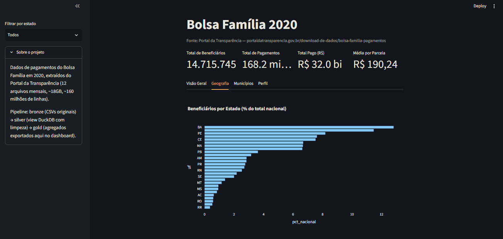
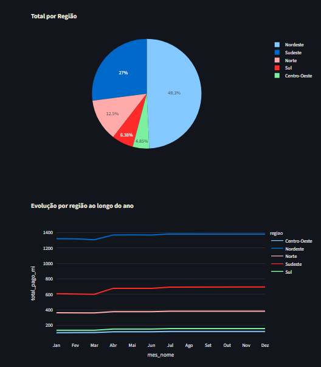
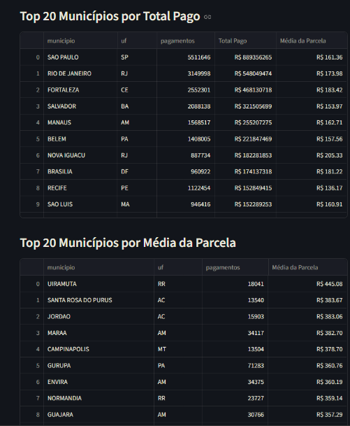
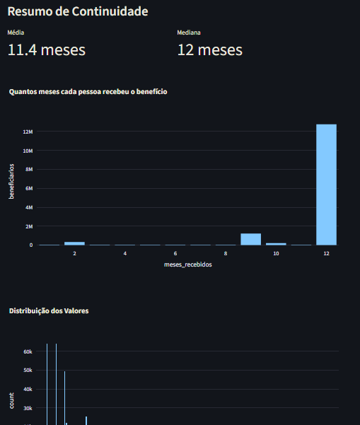

# Bolsa Família 2020: Análise Exploratória de Dados

Analisei os pagamentos do Bolsa Família em 2020 com os dados abertos do governo federal. São **cerca de 160 milhões de registros (17,6 GB)**, processados com DuckDB, olhando pra cobertura do programa, como o dinheiro se distribui pelo país e o efeito da pandemia nos números.

---

## Principais Achados

1. A pandemia aparece nos dados de um jeito bem claro. O total pago subiu **7,2% em abril de 2020**, mês do lockdown nacional, e nunca voltou ao patamar de antes. Entrou cerca de 1,2 milhão de famílias novas no programa, e ficaram.

2. O **Nordeste domina em volume**: concentra 49,4% dos beneficiários e 51,1% do gasto. Mas quem recebe mais por família, na média, é o Norte (R$ 210), reflexo de famílias maiores e pobreza mais profunda na região.

3. O programa é mais espalhado do que eu esperava antes de olhar os números. Os 5 estados que mais recebem concentram só 46% do gasto total, o que sugere que a distribuição segue a incidência de pobreza, não peso político.

4. Os municípios com maior parcela média ficam todos na Amazônia. **Uiramutã (RR)** lidera com R$ 445, mais que o dobro da média nacional, e o top 20 inteiro é Acre, Amazonas e Roraima.

5. **86,8% dos beneficiários** receberam o programa nos 12 meses do ano. Para 12,7 milhões de famílias, o Bolsa Família não foi um auxílio pontual em 2020, foi renda garantida o ano inteiro.

---

## Dataset

| Atributo | Detalhe |
|---|---|
| Fonte | [Portal da Transparência: Bolsa Família Pagamentos](https://portaldatransparencia.gov.br/download-de-dados/bolsa-familia-pagamentos) |
| Período | Janeiro a Dezembro 2020 (12 arquivos mensais) |
| Volume | Cerca de 17,6 GB, cerca de 160 milhões de linhas |
| Formato | CSV com separador `;`, decimal `,`, encoding Latin-1 |

> Os CSVs brutos não estão incluídos no repositório. Baixe os 12 arquivos de 2020 no Portal da Transparência e coloque em `data/bronze/`.

---

## Stack

| Camada | Tecnologia | Motivo |
|---|---|---|
| Query engine | **DuckDB** | Lê CSV direto sem carregar em memória, SQL analítico nativo |
| Análise | **Python + Pandas** | Manipulação de DataFrames |
| Visualização (notebook) | **Matplotlib + Seaborn** | Gráficos estáticos para o notebook |
| Notebook | **Jupyter** | Formato padrão de portfólio |
| Dashboard | **Streamlit + Plotly** | Exploração interativa dos resultados, sem precisar rodar código |

---

## Estrutura do Projeto

```
bolsa-familia-2020/
├── data/
│   ├── bronze/    → CSVs brutos do Portal da Transparência (não versionados, 17 GB)
│   ├── silver/    → não materializado (view DuckDB gerada em tempo de execução)
│   └── gold/      → resultados agregados: 15 CSVs + 12 PNGs
├── notebooks/
│   └── 01-EDA.ipynb   → notebook principal com 15 perguntas de análise
├── sql/
│   ├── silver_view.sql → definição da view de limpeza (DuckDB)
│   └── p01_*.sql … p15_*.sql → queries de análise documentadas
├── .streamlit/
│   └── config.toml    → tema escuro customizado do dashboard
├── dashboard.py        → dashboard interativo em Streamlit
└── README.md
```

### Arquitetura bronze → silver → gold

- **Bronze:** CSVs brutos, sem modificação. Fonte imutável.
- **Silver:** View DuckDB criada em tempo de execução, que normaliza colunas (snake_case), converte `VALOR PARCELA` de string BR para `DOUBLE` e deriva a coluna `regiao` a partir da UF. Não é materializada em disco para evitar duplicar 17 GB.
- **Gold:** Resultados das 15 queries exportados como CSV e PNG.

---

## Visualização

O notebook completo pode ser visualizado sem instalação pelo NBViewer:

[Abrir 01-EDA.ipynb no NBViewer](https://nbviewer.org/github/LuizGFS001/bolsa-familia-2020-eda/blob/main/notebooks/01-EDA.ipynb)

---

## Dashboard Interativo

Além do notebook, o projeto tem um dashboard em Streamlit para navegar pelos resultados sem precisar rodar código nenhum. Ele lê direto os CSVs já exportados em `data/gold/`, então funciona mesmo sem reprocessar os 17 GB do bronze.

O conteúdo está dividido em quatro abas:

- **Visão Geral**: evolução mensal de beneficiários, total pago e variação percentual
- **Geografia**: ranking de estados, distribuição por região e valor médio da parcela, com filtro por UF na barra lateral
- **Municípios**: top 20 por total pago e por parcela média
- **Perfil do Beneficiário**: quantos meses cada família recebeu o benefício e a distribuição dos valores de parcela

<table>
<tr>
<td></td>
<td></td>
</tr>
<tr>
<td></td>
<td></td>
</tr>
<tr>
<td></td>
<td></td>
</tr>
</table>

### Rodar o dashboard

```bash
pip install streamlit plotly
streamlit run dashboard.py
```

O navegador abre sozinho, normalmente em `localhost:8501`.

---

## Como Executar

### Requisitos

```bash
pip install duckdb pandas matplotlib seaborn jupyter
```

### Dados

Baixe os 12 arquivos mensais de 2020 em:
https://portaldatransparencia.gov.br/download-de-dados/bolsa-familia-pagamentos

Coloque todos em `data/bronze/`.

### Rodar o notebook

```bash
jupyter notebook notebooks/01-EDA.ipynb
```

Execute todas as células em ordem (Kernel → Restart & Run All). Os resultados serão exportados automaticamente para `data/gold/`.

> **Tempo estimado:** 30 a 60 minutos dependendo do hardware (leitura e processamento de 17 GB via DuckDB).

---

## Perguntas Respondidas

| # | Pergunta |
|---|---|
| P1 | Volume total: beneficiários, pagamentos e gasto em 2020 |
| P2 | Evolução mensal do número de beneficiários |
| P3 | Evolução mensal do total pago (R$) |
| P4 | Variação percentual mensal no total pago |
| P5 | Estados com mais beneficiários únicos |
| P6 | Distribuição por região (beneficiários e gasto) |
| P7 | Participação de cada estado no total nacional |
| P8 | Valor médio de parcela por estado |
| P9 | Distribuição dos valores de parcela (histograma) |
| P10 | Top 20 municípios por total pago |
| P11 | Top 20 municípios por parcela média (mín. 1.000 pagamentos) |
| P12 | Total pago por região em cada mês (evolução empilhada) |
| P13 | Distribuição de meses recebidos por beneficiário |
| P14 | Média e mediana de meses recebidos |
| P15 | Concentração do gasto por estado (% do total nacional) |
